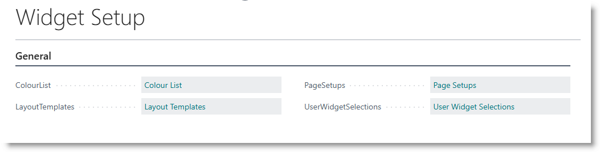
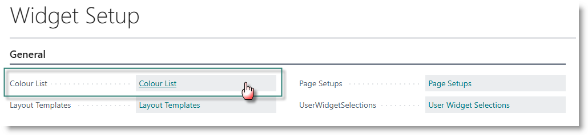
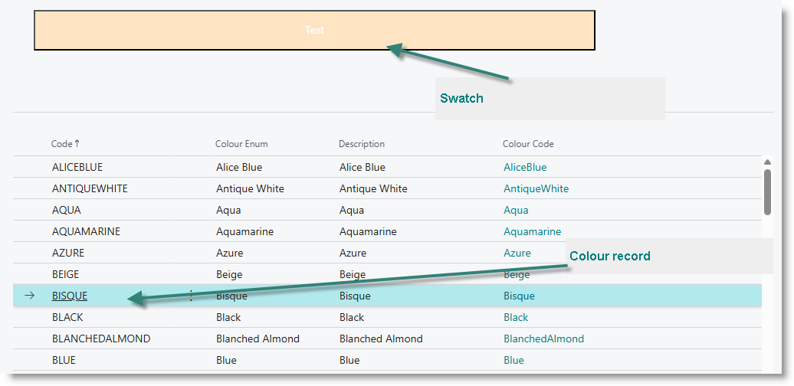
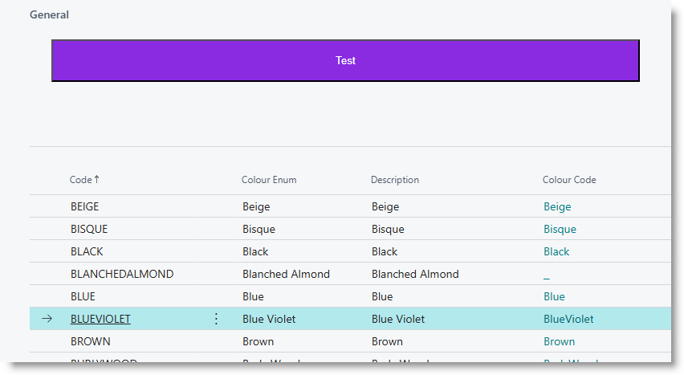
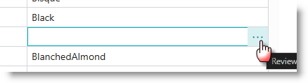
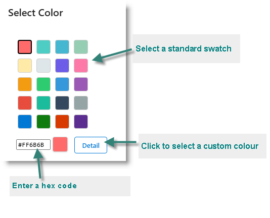
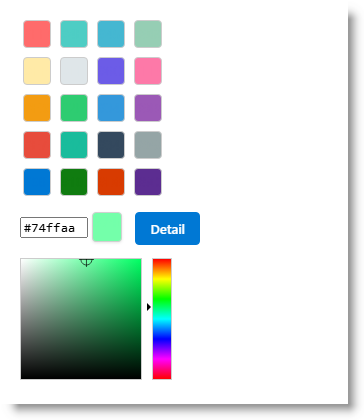

# Braintree Widgets Configuration
Braintree Widgets come pre-installed colour definitions, templates and page configurations, so you can get going as fast as possible. You have the option to modify any of these to suit your own tastes and requirements.

## Widgets Setup
Search for 'Widgets Setup', and open the page:

## Colour List
The Colour List is used to review and configure colours which can be applied to templates and page setups.

From the Widget Setups page, click on 'Colour List':

The list of predefined standard colours will be presented. As you click on each record, a sample swatch of the colour will appear in the page header:

### Adding a custom colour
Click on New.
In the blank record, capture as follows:

| **Column** |**Value** | 
|---|---|
|Code|Provide a unique code of up to 20 characters|
|Colour Enum | Select 'Custom' |
|Description | Enter a user-friendly description |
|Colour Code | Enter the Hex code, or click on the (...) to pick a colour|

**Picking a colour**

The colour picker appears:

Click on one of the standard swatches to select the colour

If you have the hex code, enter it in the input box

Click on Detail to select from the palette. 

The related hex code will be returned to the Colour Picker. 
Click OK to return to the colour setup list.

## The Widgets Role Centre
Go to Settings -> My Settings:

Click on the (...) next to Role:

Select 'Braintree Widgets' and click on OK:

The Widgets Role Centre will appear:

## Colour Selections

## Layout Templates
Braintree Widgets comes pre-installed with a number of layout templates, which can be used to configure layouts for different Widgets. They provide a range of options for colour schemes and sizing.

