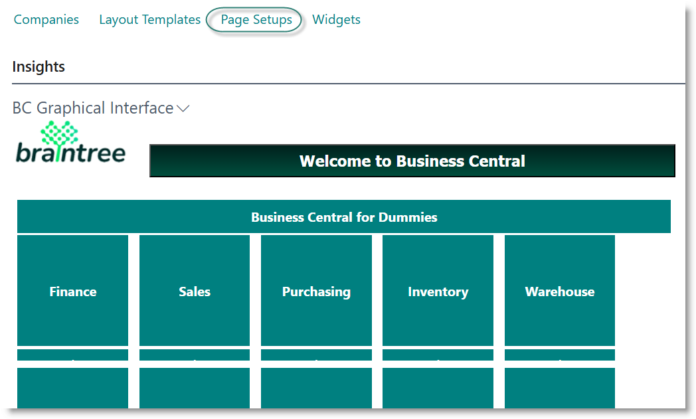
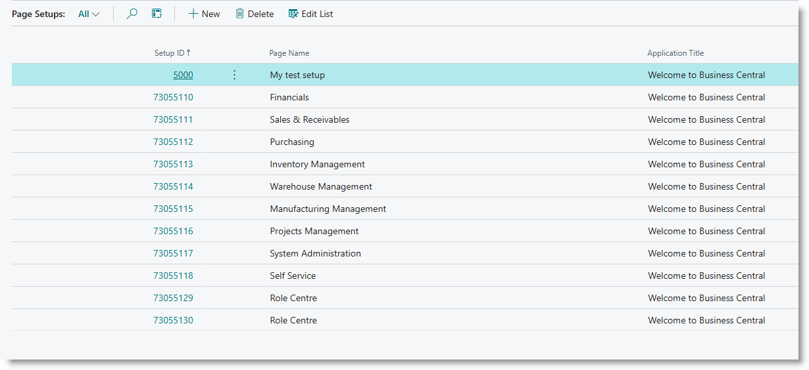
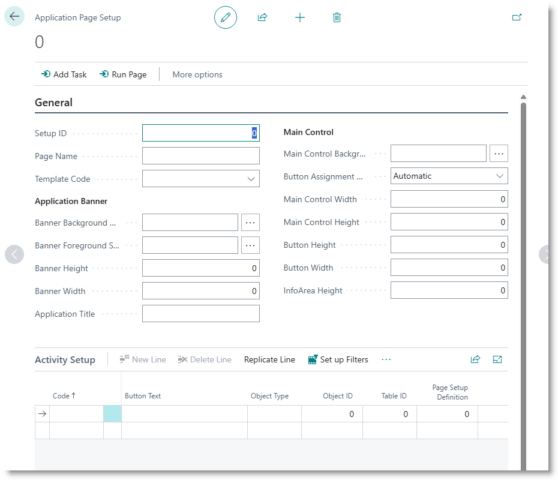
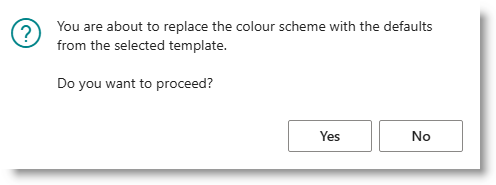
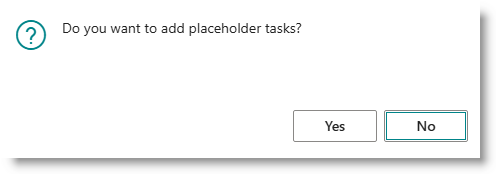
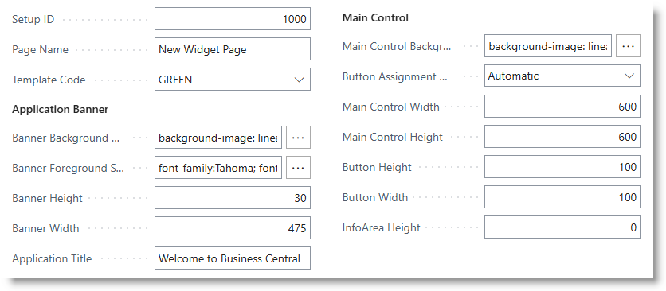

# Setting up pages

BC Widgets allows you to build personalised pages which resemble a standard Microsoft Dynamics 365 Business Central role centre. You can use these to
- simplify the user experience by removing the clutter of unneeded functions
- build personalised 'role centres' without the need to rely on a developer
- build dashboards to display key performance indicators.

The app comes with a few prebuilt pages, giving access to each major module of Microsoft Dynamics 365 Business Central.

This section provides instructions on how to build a page to be displayed as a role centre, or to run a widget page.

## Create a new page
From the role centre, select 'Page Setups':

Or search for Widget Setup List. The pages already defined will be displayed:

Click on New. The Page Setup card will open:

Create the page header as follows:

|**Field** |**Value**|
|---|---|
|Setup ID|Supply an integer number |
|Page Name |Enter a text description|
|Template Code|Select an option from the dropdown|

Reply Yes to the dialog.

Reply Yes or No to the next dialog. (Replying YES will cause the system to create some placeholder activities in the subpage.)

The system will copy the formatting options - colours, sizes, fonts etc - from the template. From here, you can edit as required.

You can edit the remaining fields as follows:

|**Field** |**Value**|
|---|---|
|Banner Background Style |Click on ... to open the style helper |
|Banner Foreground Style |Click on ... to open the style helper|
|Banner Height|Enter the height in pixels for the page banner. This should be a smallish number such as 30|
|Application Title|Enter a text description |
|Main Control Background Style ||
|Main Control Width||
|Main Control Height||
|Button Height||
|Button Width||
|Info Area Height||

w1