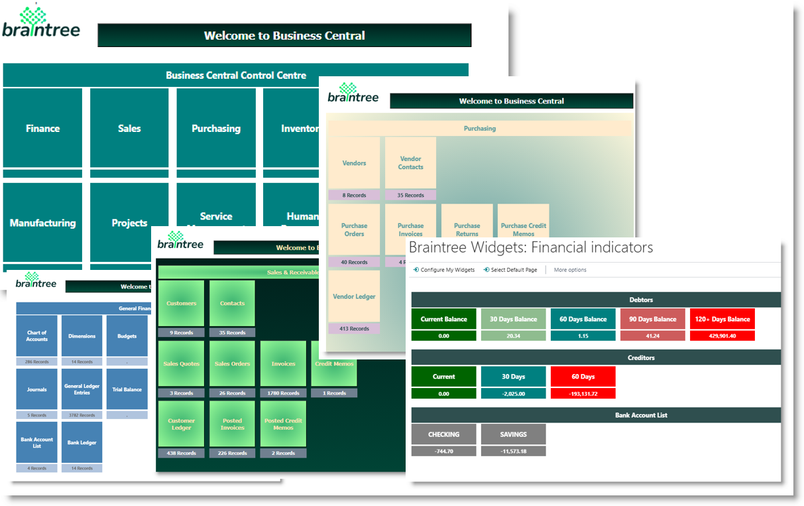

# BC Widgets
BC Widgets provides a new-look user interface for Microsoft Dynamics 365 Business Central.
Role Centres in Microsoft Dynamics 365 Business Central are great, but they have limited flexibility, and they are often cluttered with functions you never use. Changing a role centre, or creating a new role centre, has historically necessitated engaging with a developer.

Using BC Widgets, an end user is able to :
- Configure their own role centre with the functions most relevant to their daily tasks
- Build a dashboard of useful information, giving a quick overview of key performance indicators relevant to the business and the user's role
- Configure different colour schemes and layouts according to personal preference and functionality.
- Stay focussed on the things you care about.

BC Widgets also allows you to configure custom fields on various entities in Business Central.

## [Configuration](Configuration.MD)

## [Setting up Pages](PageSetups.MD)